# Top-associated $H \to \gamma\gamma$ hadronic BDT categorization

*Generated 2026-09-09T00:19:55.452170+00:00 — run `tth-diphoton-bdt`, total wall time 40.4 s.*

## Introduction

This report documents an end-to-end preselection and **hadronic** top-associated ($ttH$ / $tH$) $H \to \gamma\gamma$ BDT categorization built on the ATLAS open-data `GamGam` ntuples. The pipeline selects a diphoton Higgs candidate without photon tight-ID or isolation requirements, defines a hadronic top-enriched channel, trains a deterministic five-variable gradient-boosted classifier to separate $ttH+tH$ from a mixture of resonant $ggH$ and a data-driven continuum proxy, optimises BDT category boundaries iteratively, assigns the six hadronic categories, and finally builds a combined ROOT/RooFit workspace from which an Asimov expected discovery significance is extracted.

**Scope note.** The categorization required here is hadronic-only. The current open-data ROOT inputs contain *no reconstructed forward jets* (`n_jets_forward == 0` for all 125381 selected rows), so leptonic top-associated categories are out of scope for the BDT optimisation, the category assignment, the significance summaries and the final plots. Leptonic preselection rows are still written for provenance and are clearly labelled (`preselection_channel == "leptonic_bookkeeping"`); they are excluded from training, boundary optimisation, categorization metrics and the statistical workspace.

**Blinding.** Observed tight-ID + tight-isolation (TI) data in the $125 \pm 2$ GeV signal window is never inspected, counted, plotted or reported. The observed significance is **blocked** unless an explicit unblinding step is added. The 120–130 GeV removal policy applies *only* to observed TI data: the NTI control sample retains its 120–130 GeV entries because it is not the signal-enriched sample.

## Data and Monte Carlo Samples

Inputs are read in place from `/data/GamGam` (resolved from `$TB_HYY_INPUTS`, the same external input contract as `tb-hyy`), with the expected `MC/` and `data/` layout. **No ROOT input is copied into the submission directory.**

> This run processes ONLY nominal Higgs H->gamma gamma signal MC (ggH, VBF, WH, ZH, ggZH, ttH, tH) and observed GamGam data. Sherpa yy / prompt-diphoton continuum MC and every other non-Higgs MC sample (ttbar, single top, V+jets, ...) are explicitly EXCLUDED: they are neither opened nor read. The continuum background is instead modelled data-driven, from the NTI diphoton control sample (BDT training and categorization control estimates) and from the observed TI data sidebands (statistical workspace).

| sample | role | kind | file size | selected rows | weighted yield @ 36.0 fb$^{-1}$ |
|---|---|---|---|---|---|
| `ggH` | resonant_higgs | mc | 1.1 MB | 2252 | 7.262 |
| `VBF` | resonant_higgs | mc | 0.1 MB | 49 | 0.1655 |
| `WH` | resonant_higgs | mc | 0.4 MB | 791 | 0.2402 |
| `ZH` | resonant_higgs | mc | 0.4 MB | 860 | 2.175 |
| `ggZH` | resonant_higgs | mc | 0.4 MB | 846 | 0.2023 |
| `ttH` | signal_top | mc | 47.3 MB | 87735 | 30.7 |
| `tH` | signal_top | mc | 5.4 MB | 10819 | 0.2353 |
| `data` | observed_data | data | 51.8 MB | 22029 | 0 |

MC events are normalised with the SM-normalised weight

```
w = L * sigma[pb] * k-factor * filter_eff / sum_of_signed_generator_weights
      * mcWeight * SF_PILEUP * SF_PHOTON * SF_BTAG * SF_JVT
```

with the absolute MC integrated luminosity set to **36.0 fb$^{-1}$** for all expected yields and significances. Signed generator weights are kept explicit throughout: 11749 selected MC rows carry a negative weight (sum of positive weights 47.64, sum of negative weights -6.658).

**Row policy.** The run is **uncapped** by default (`max_selected_per_sample = None`, source: unset (uncapped)). `TTH_MAX_SELECTED_PER_SAMPLE` limits the number of *selected* rows per sample only when explicitly set for development throttling; when set, rows are taken deterministically in `event_id` order.

## Object Definition and Event Selection

**Photons.** $p_T > 25.0$ GeV, $|\eta| < 2.37$ excluding the calorimeter crack [1.37, 1.52], plus the relative-$p_T$ cuts $p_T^{lead}/m_{\gamma\gamma} > 0.35$ and $p_T^{sublead}/m_{\gamma\gamma} > 0.25$. **Photon tight ID is NOT required and photon isolation is NOT required** for this preselection sample — this is recorded explicitly in `object_definition_record.json`. The tight-ID/tight-isolation flags are read only to define the TI/NTI control categories.

* **TI** diphoton: *both* photons pass tight ID *and* tight isolation.
* **NTI** diphoton: *at least one* photon fails tight ID or fails tight isolation.

$m_{\gamma\gamma}$ is retained for bookkeeping and later validation (mass windows, control shapes, workspace) and is **never** a classifier input.

**Electrons and muons.** $p_T > 10.0$ GeV; no lepton ID and no lepton isolation requirement.

**Jets.** $p_T > 25.0$ GeV; central jets $|\eta| \le 2.5$, forward jets $|\eta| > 2.5$. The documented b-tag definition is `jet_btag_quantile >= 4`. The current ATLAS open-data GamGam ntuples contain no reconstructed jets with |eta| > 2.5, so n_jets_forward is identically 0 in this run. Leptonic top-associated categories that rely on forward jets are therefore out of scope.

**Channels.**

* *Hadronic* (required): n_leptons == 0 AND n_jets >= 3 AND n_bjets >= 1 — **80585** rows.
* *Leptonic bookkeeping* (optional, provenance only): n_leptons >= 1 AND n_bjets >= 1 (provenance only; excluded from BDT training, boundary optimisation, categorization metrics and the workspace) — **44796** rows.

**Partitioning.** Events are partitioned by the stable identifier `event_id = sample|channelNumber|runNumber|eventNumber` via BLAKE2b(seed:event_id) -> uniform [0,1) -> bucket with seed 20240917 and fractions {'train': 0.6, 'val': 0.2, 'test': 0.2} — never by row order. Counts: {'train': 75175, 'test': 25161, 'val': 25045}.

**Validation.** 1099 randomly chosen selected events were re-derived with the scalar reference implementations (`invariant_mass`, `build_jet_features`, `build_lepton_features`) and compared to the vectorised pipeline: **0 mismatches**.

## Overview of the Analysis Strategy

1. **Preselection** — build the diphoton candidate, count leptons, jets and b-jets, tag the channel, assign a stable partition, and record raw and weighted counts with signed-weight bookkeeping.
2. **Continuum proxy** — normalise the NTI data control sample with the sideband scale factors `SF1`, `SF2`.
3. **BDT training** — $ttH+tH$ (SM-normalised MC) versus a $ggH$ + NTI mixture; class balancing is applied *only after* the physical weights and the mixture have been constructed.
4. **Boundary optimisation** — iterative, 5 % relative-improvement stopping rule on the expected combined counting significance.
5. **Categorization** — six hadronic categories plus `unassigned`, with a 0.8-event minimum-background retention requirement.
6. **Statistical interpretation** — combined RooFit workspace, S+B Asimov with $\mu_{gen} = 1$, expected discovery significance from the likelihood-ratio test statistic.

**BDT features** (exactly five, `BDT_FEATURES`): `n_jets_central`, `n_bjets`, `ht_jets`, `met`, `pt_gg`. `m_gammagamma` is deliberately excluded so the classifier does not sculpt the continuum mass shape used by the workspace fit.

**Classifier**: `sklearn.HistGradientBoostingClassifier` — `loss=log_loss`, `learning_rate=0.06`, `max_iter=400`, `max_leaf_nodes=16`, `min_samples_leaf=60`, `l2_regularization=1.0`, `max_bins=128`, `early_stopping=False`, `random_state=20240917`. Deterministic (fixed random_state, early_stopping disabled, single-threaded numeric backends (OMP_NUM_THREADS=1)). Training wall time **0.97 s** (stage `bdt_training`). Weighted AUC: train 0.8441, val 0.836, test 0.8383.

## Signal and Control Regions

| region | $m_{\gamma\gamma}$ | use |
|---|---|---|
| fit range | 105–160 GeV | workspace observable range |
| signal window | 123–127 GeV ($125 \pm 2$) | expected-yield model |
| low sideband | 105–120 GeV | continuum control |
| high sideband | 130–160 GeV | continuum control |
| blinded (observed TI only) | 120–130 GeV | never inspected |

**Signal definition.** $ttH$ + $tH$ TI MC in $125 \pm 2$ GeV, hadronic preselection, weighted with the SM-normalised MC weight.

**Background definition for the classifier.** Resonant $ggH$ TI MC in $125 \pm 2$ GeV **plus** the NTI continuum proxy built from the observed data sidebands.

**NTI continuum normalisation** (hadronic preselection, observed data):

| quantity | value |
|---|---|
| TI sideband yield | 512 |
| NTI sideband yield | 15771 |
| NTI $125\pm2$ GeV yield | 1537 |
| `SF1` = TI$_{SB}$/NTI$_{SB}$ | 0.0324647 |
| `SF2` = NTI$_{125\pm2}$/NTI$_{SB}$ | 0.0974574 |
| `SF1*SF2` | 0.00316392 |
| implied continuum yield in $125\pm2$ GeV | 49.9 |
| TI $125\pm2$ GeV yield | **BLINDED** |

**Class balancing** is applied *only after* the SM-normalised signal weights and the $ggH$ + NTI background mixture weights have been constructed:

| quantity | before balancing | after balancing |
|---|---|---|
| signal class weight sum | 9.847 | 31.76 |
| background class weight sum | 53.67 | 31.76 |
| S/B weight ratio | 0.1835 | 1 |
| raw rows | 22898 | 16821 |

Nominal TI observed data in $125 \pm 2$ GeV is **not** used for BDT training and **not** used for threshold optimisation.

## Cut Flow

| stage | `ggH` | `VBF` | `WH` | `ZH` | `ggZH` | `ttH` | `tH` | `data` |
|---|---|---|---|---|---|---|---|---|
| input_rows | 2551 | 59 | 912 | 1012 | 962 | 102792 | 12594 | 235202 |
| photons_in_kinematic_acceptance>=2 | 2532 | 59 | 909 | 1008 | 954 | 102190 | 12512 | 219854 |
| mgg_in_105_160 | 2511 | 58 | 891 | 983 | 937 | 98724 | 12121 | 36375 |
| relative_pt_cuts | 2252 | 49 | 791 | 860 | 846 | 87735 | 10819 | 22029 |
| hadronic_or_leptonic_channel | 2252 | 49 | 791 | 860 | 846 | 87735 | 10819 | 22029 |
| hadronic_channel | 2147 | 43 | 617 | 704 | 758 | 49347 | 6541 | 20428 |
| leptonic_bookkeeping_only | 105 | 6 | 174 | 156 | 88 | 38388 | 4278 | 1601 |

Weighted yields, sums of positive/negative weights and negative-weight event counts per stage are in `cutflow.json`.

## Distributions in Signal and Control Regions

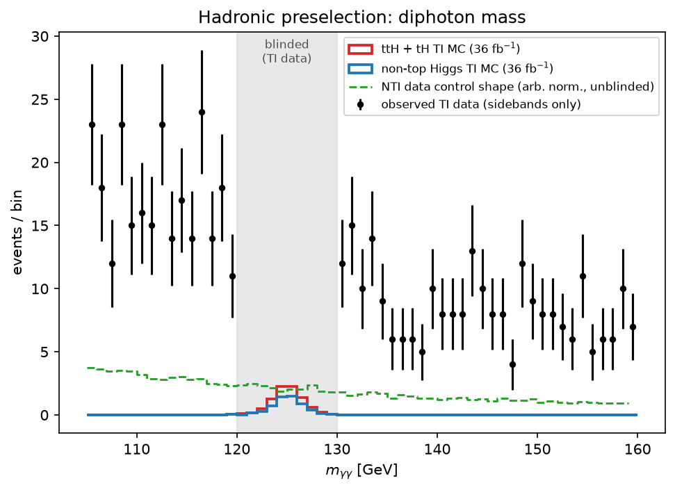

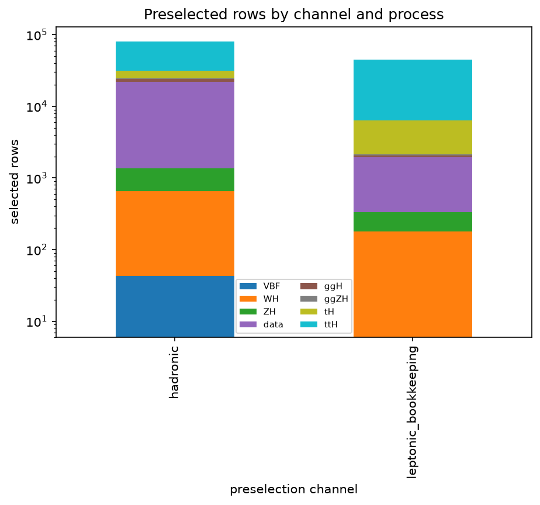

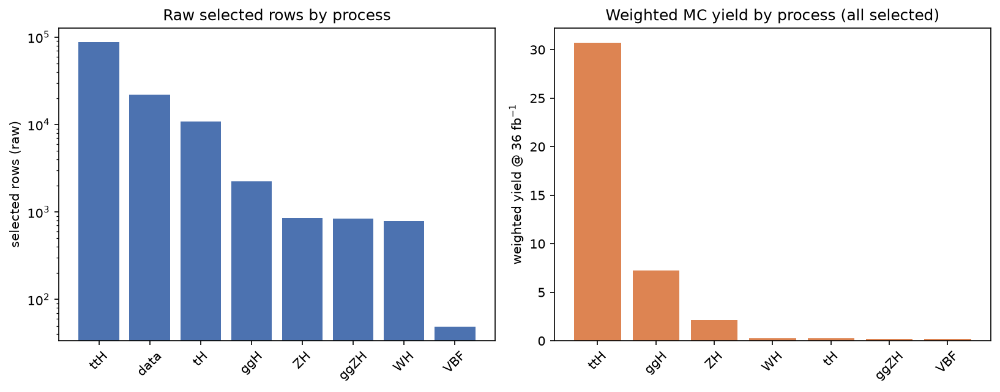

BDT-score shape comparison, with each component normalised to the same area over explicit $[0, 1]$ binning (20 bins):

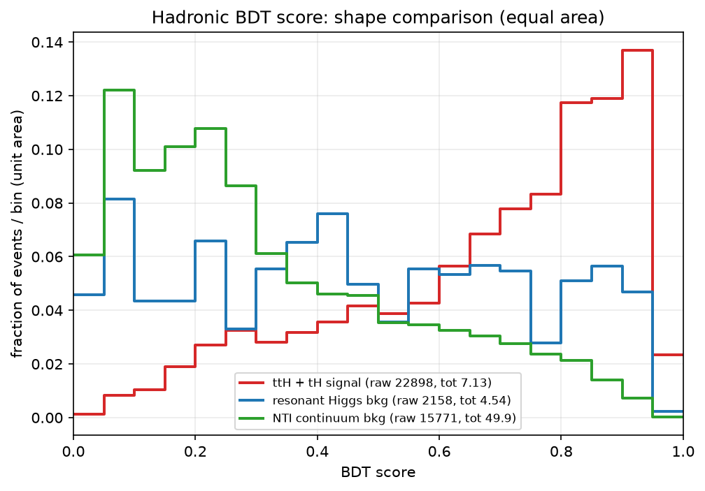

Machine-readable histogram: `plots/score_by_component_histograms.json` (bin edges, normalised bin contents, component totals *before* shape normalisation).

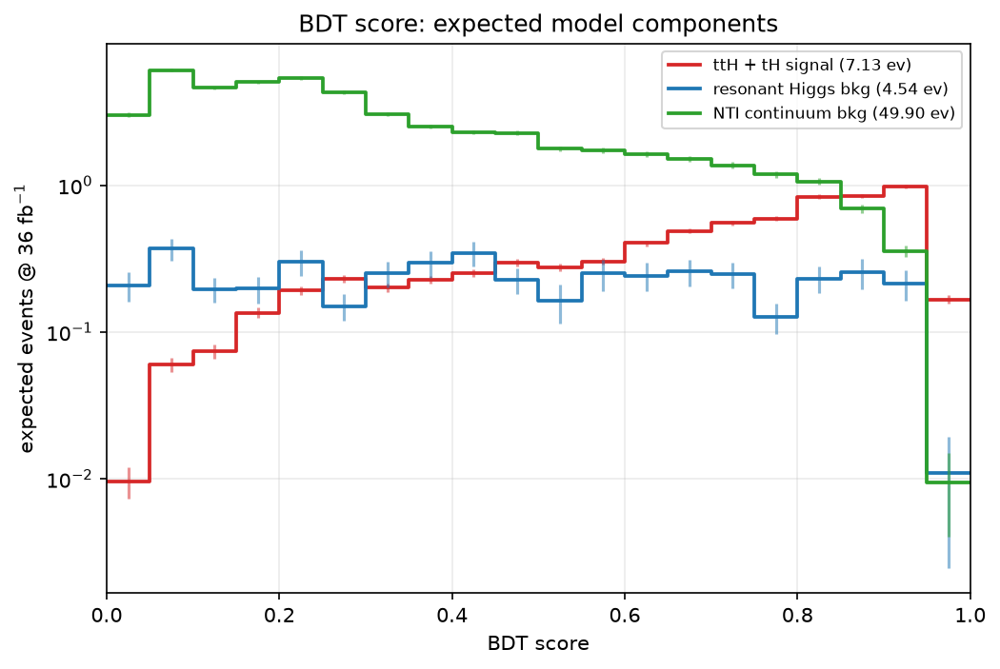

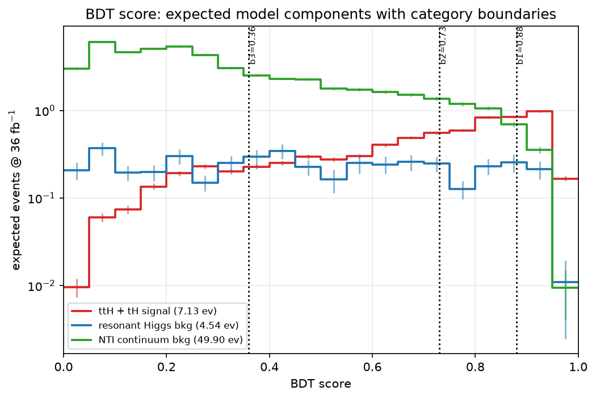

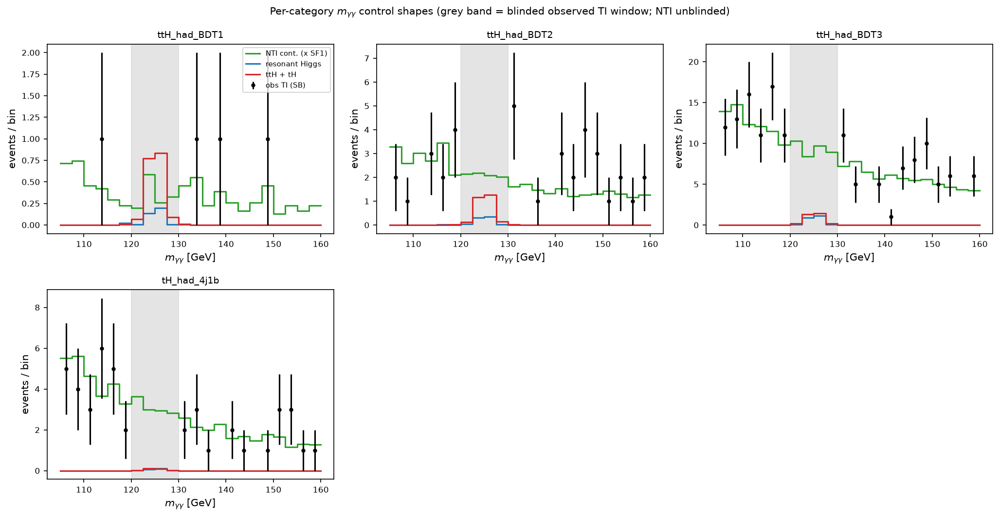

The per-category $m_{\gamma\gamma}$ control shapes keep all NTI entries in 120–130 GeV; only the observed TI points are removed in that window.

## Categorization

Category priority order (`CATEGORY_ORDER`): `ttH_had_BDT1` → `ttH_had_BDT2` → `ttH_had_BDT3` → `ttH_had_BDT4` → `tH_had_4j1b` → `tH_had_4j2b` → `unassigned`.

The BDT boundaries were optimised iteratively: a boundary is added only while the relative improvement in expected significance with respect to the previous iteration is at least 5 %.

| iteration | new boundary | boundary set | combined $Z$ | relative improvement | decision |
|---|---|---|---|---|---|
| 1 | 0.73 | [0.73] | 1.513 | — | accepted |
| 2 | 0.88 | [0.88, 0.73] | 1.64 | 8.4 % | accepted |
| 3 | 0.36 | [0.88, 0.73, 0.36] | 1.752 | 6.8 % | accepted |
| 4 | 0.6 | [0.88, 0.73, 0.6, 0.36] | 1.767 | 0.9 % | REJECTED (relative-improvement-below-threshold) |

Accepted boundary sequence: **[0.88, 0.73, 0.36]** (descending; the highest boundary defines `ttH_had_BDT1`). Optimisation used the 36 fb$^{-1}$ expected-yield weights (`significance_model_weight_36fb`); the class-balanced `bdt_fit_weight` is never used for yields or significance.

The `tH_had_4j1b` / `tH_had_4j2b` categories are cut-based and lower-priority: they are evaluated **only after** an event has failed every hadronic BDT category, and require $N_{leptons} = 0$, exactly four **central** jets, and exactly one b-tag (`4j1b`) or at least two b-tags (`4j2b`).

**Retention.** A non-catch-all physics category is kept only if its TOTAL expected background yield in the 125 +/- 2 GeV signal window is >= 0.8 events, after applying the resonant Higgs normalisation and the scaled NTI continuum normalisation.

Kept: ['ttH_had_BDT1', 'ttH_had_BDT2', 'ttH_had_BDT3', 'tH_had_4j1b']. Dropped/merged into `unassigned`: ['ttH_had_BDT4', 'tH_had_4j2b'].

| category | $ttH+tH$ | resonant $H$ | NTI continuum | total bkg | total model | $S/B$ | $S/\sqrt{B}$ | expected $Z$ |
|---|---|---|---|---|---|---|---|---|
| `ttH_had_BDT1` | 1.483 | 0.3142 | 0.6201 | 0.9344 | 2.418 | 1.588 | 1.535 | 1.277 |
| `ttH_had_BDT2` | 2.199 | 0.5928 | 3.287 | 3.88 | 6.079 | 0.5666 | 1.116 | 1.03 |
| `ttH_had_BDT3` | 2.504 | 1.886 | 13.93 | 15.81 | 18.32 | 0.1584 | 0.6298 | 0.6142 |
| `tH_had_4j1b` | 0.1819 | 0.1423 | 4.667 | 4.809 | 4.991 | 0.03782 | 0.08294 | 0.08242 |
| `unassigned` | 6.797 | 2.434 | 31.31 | 33.75 | 40.54 | 0.2014 | 1.17 | 1.134 |

**Combined expected counting significance: 1.7536** (quadrature sum over kept categories, 36.0 fb$^{-1}$).

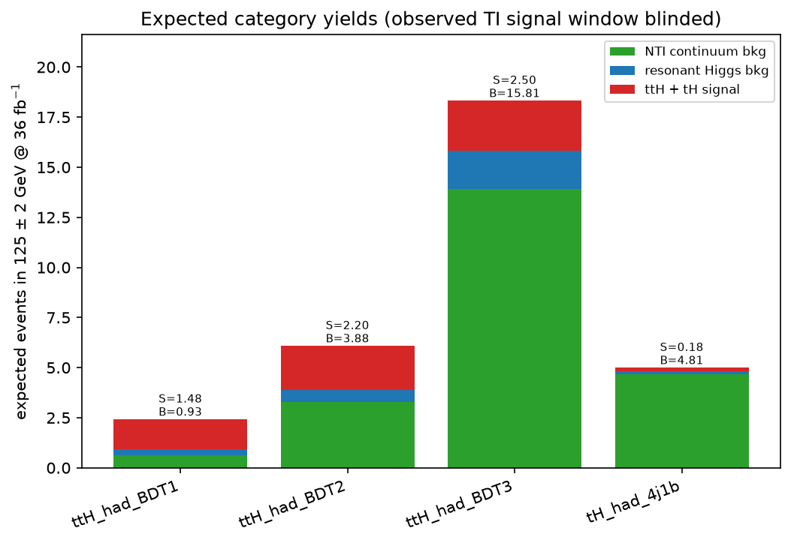

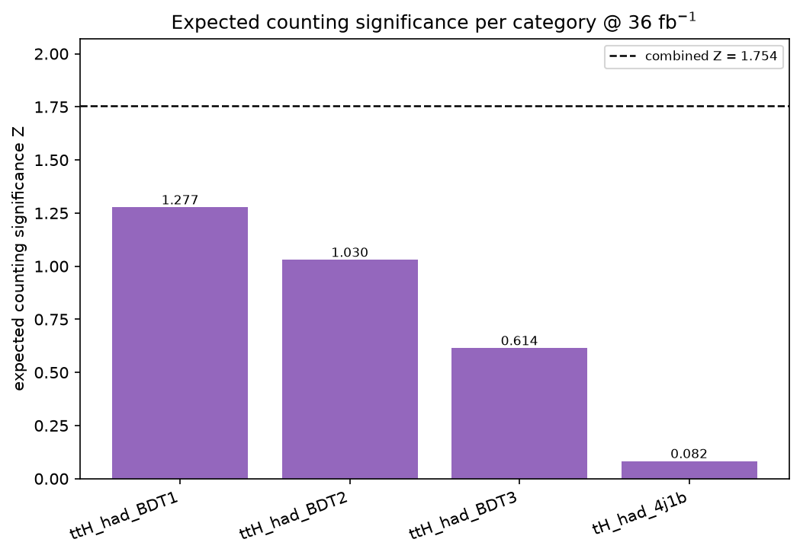

Expected yields use the signal-window model: TI MC events in $125 \pm 2$ GeV normalised to 36 fb$^{-1}$ plus observed-data NTI sideband events scaled by `SF1*SF2`. Observed-data unit weights are kept separately in `observed_data_weight`, the NTI proxy weight in `nti_continuum_weight`, and the model weight in `significance_model_weight_36fb`.

## Systematic Uncertainties

No systematic uncertainties are propagated in this starting-point pipeline: every number quoted above is statistical only, and the workspace contains no nuisance parameters beyond the floating continuum normalisation and shape parameters. The dominant systematic effects that a full analysis would need are listed here for completeness, together with where they would enter this pipeline.

| source | affects | handling / provenance in this run |
|---|---|---|
| Continuum background modelling (spurious signal) | choice of continuum PDF per category | `fit/FIT1/background_pdf_scan.json` records the AIC scan over exponential / power-law / exponential-polynomial / Bernstein |
| NTI proxy closure | `SF1`, `SF2` and their region dependence | recorded in `model/background_mixture_and_normalization.json`; an inclusive cross-check is stored alongside the hadronic values |
| Photon energy scale/resolution | signal and resonant mass shapes | would shift `mean`/`sigma` in `signal_pdf.json` |
| Jet energy scale, JVT, b-tagging | migration between BDT categories and the 4j1b/4j2b cut-based ones | `ScaleFactor_BTAG`, `ScaleFactor_JVT` are already applied nominally |
| Luminosity, pileup, photon ID/isolation SFs | overall normalisation | `ScaleFactor_PILEUP`, `ScaleFactor_PHOTON` |
| Higgs cross sections and branching ratio | signal and resonant-background normalisation | `xsec`, `kfac`, `filteff` taken from the input ntuple metadata |
| MC statistics | template shapes in low-population categories | categories fall back to the inclusive hadronic shape below 100 raw MC rows |

## Statistical Interpretation

A combined **ROOT/PyROOT/RooFit** workspace (`6.38.00`) is built over the 4 hadronic categories used in the final categorization; leptonic bookkeeping rows are excluded. In each category the expected mass spectrum is

$$ \mu \cdot (ttH+tH) \;+\; \text{fixed resonant-Higgs background} \;+\; \text{floating smooth continuum} $$

with **one shared signal-strength parameter $\mu$** multiplying the $ttH+tH$ component across all categories. The $ttH+tH$ TI MC provides the signal mass shape and normalisation; the non-top Higgs TI MC provides the fixed resonant background.

For the statistical workspace the smooth continuum is determined **from observed TI data sidebands only** (105–120 and 130–160 GeV): the fitted PDF and the fitted sideband normalisation are extrapolated into the full 105–160 GeV fit range, and that fitted PDF generates the continuum part of the S+B Asimov data. This is deliberately distinct from the NTI proxy used for BDT training and categorization control estimates.

| category | $N_{sig}$ (36 fb$^{-1}$) | $N_{res}$ (36 fb$^{-1}$) | TI sideband events | extrapolated continuum (105–160) | continuum PDF |
|---|---|---|---|---|---|
| `ttH_had_BDT1` | 1.779 | 0.38 | 4 | 4.905 | `exponential` |
| `ttH_had_BDT2` | 2.746 | 0.7496 | 36 | 43.89 | `power_law` |
| `ttH_had_BDT3` | 3.19 | 2.199 | 144 | 179.8 | `power_law` |
| `tH_had_4j1b` | 0.2417 | 0.1946 | 43 | 53.72 | `power_law` |

S+B Asimov pseudo-data is generated with $\mu_{gen} = 1$; a free-$\mu$ fit and a $\mu = 0$ fit give:

| quantity | value |
|---|---|
| $\hat{\mu}$ | 1 |
| $\sigma_{\mu}$ | 0.7086 |
| free-$\mu$ fit status / covQual | 0 / 3 |
| $\mu=0$ fit status / covQual | 0 / 3 |
| $q_0 = 2(\mathrm{NLL}_0 - \mathrm{NLL}_{\hat{\mu}})$ | 2.835 |
| **expected $Z = \sqrt{q_0}$** | **1.684** |
| observed $Z$ | **blocked (blinded)** |

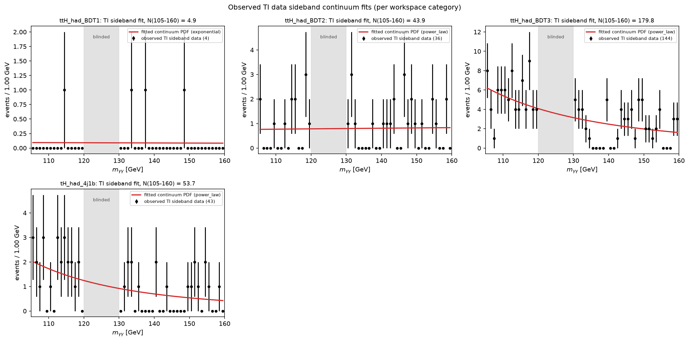

Per-category sideband-fit diagnostics (observed TI sideband data, fitted continuum PDF, blinded window, explicit binning) are also written as individual files:

* `fit/FIT1/plots/sidebands_background_fit_ttH_had_BDT1.png` — 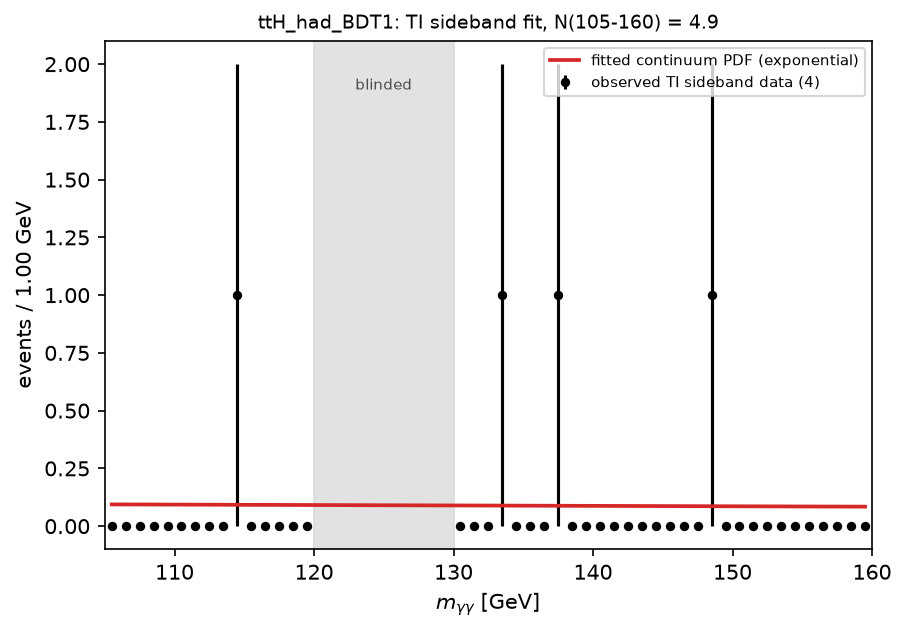
* `fit/FIT1/plots/sidebands_background_fit_ttH_had_BDT2.png` — 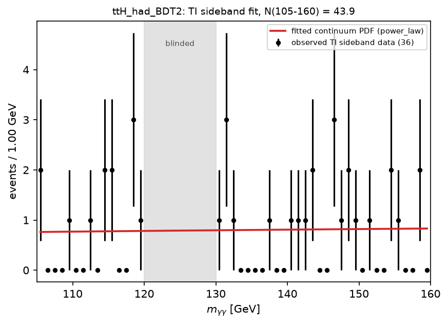
* `fit/FIT1/plots/sidebands_background_fit_ttH_had_BDT3.png` — 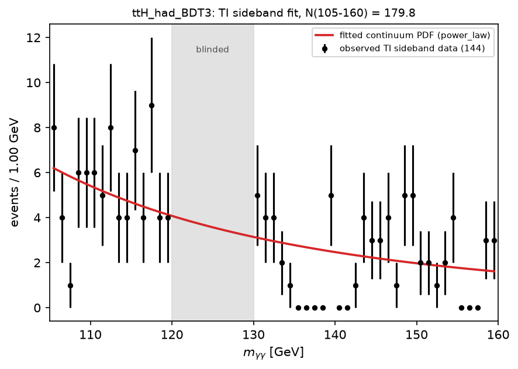
* `fit/FIT1/plots/sidebands_background_fit_tH_had_4j1b.png` — 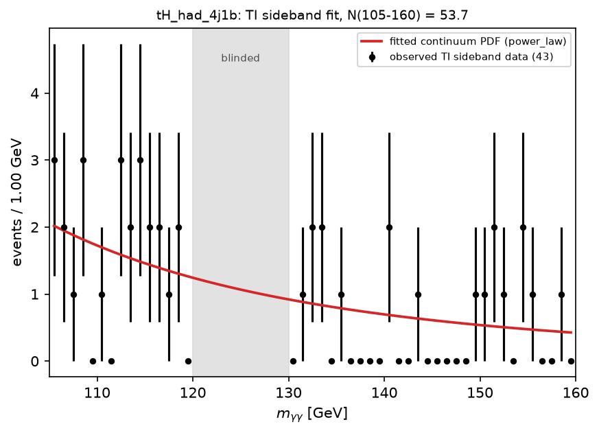

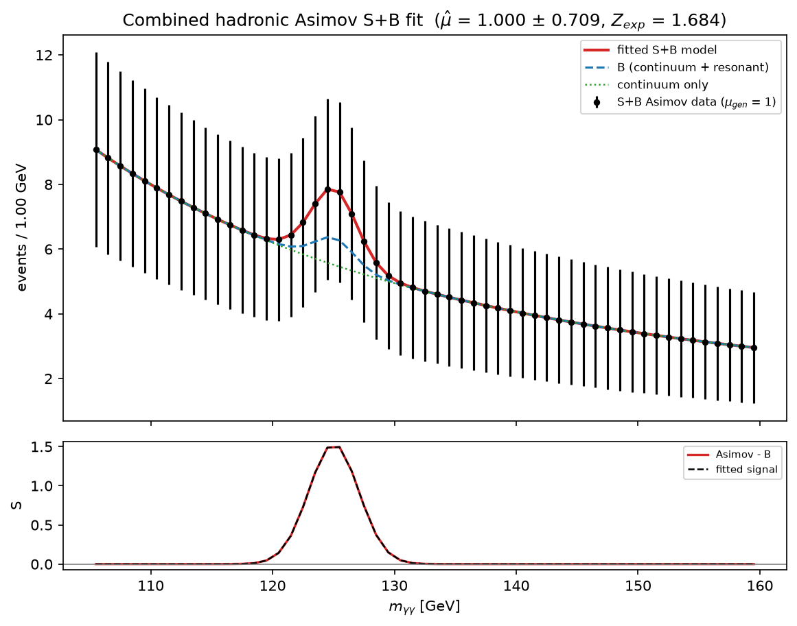

Observed TI data in $125 \pm 2$ GeV remains blinded; the observed significance is **blocked unless an explicit unblinding step is added**. The combined expected counting significance (1.7536) and the RooFit Asimov expected significance (1.684) are complementary estimates: the former is a pure counting estimate in the $125 \pm 2$ GeV window, the latter exploits the full 105–160 GeV mass shape.

## Artifact Checklist

| artifact | present | size |
|---|---|---|
| `config_resolved.yaml` | yes | 3,411 B |
| `input_data_contract.json` | yes | 4,803 B |
| `object_definition_record.json` | yes | 2,556 B |
| `preselection_summary.json` | yes | 16,203 B |
| `cutflow.json` | yes | 18,038 B |
| `metrics.json` | yes | 8,408 B |
| `preselected_events.csv` | yes | 75,686,288 B |
| `predictions.csv` | yes | 45,935,447 B |
| `hadronic_features.csv` | yes | 19,935,699 B |
| `inference/inference_manifest.json` | yes | 2,883 B |
| `inference/events_with_bdt_scores.csv` | yes | 61,776,822 B |
| `category_yields_36fb.json` | yes | 4,139 B |
| `categorization/categorization_manifest.json` | yes | 2,729 B |
| `categorization/category_summary.csv` | yes | 1,337 B |
| `categorization/category_component_yields.json` | yes | 3,187 B |
| `categorization/category_retention.json` | yes | 4,196 B |
| `categorization/histograms/category_mgg_control_histograms.json` | yes | 25,859 B |
| `categorization/histograms/bdt_score_model_component_histograms.json` | yes | 5,545 B |
| `categorization/plots/category_expected_yields_36fb_v1.png` | yes | 64,874 B |
| `categorization/plots/category_expected_yields_36fb_v1.pdf` | yes | 21,675 B |
| `categorization/plots/category_expected_counting_z_36fb_v1.png` | yes | 59,123 B |
| `categorization/plots/category_expected_counting_z_36fb_v1.pdf` | yes | 17,933 B |
| `categorization/plots/bdt_score_model_components_36fb_v1.png` | yes | 50,011 B |
| `categorization/plots/bdt_score_model_components_36fb_v1.pdf` | yes | 19,936 B |
| `categorization/plots/bdt_score_model_components_with_boundaries_36fb_v1.png` | yes | 62,952 B |
| `categorization/plots/bdt_score_model_components_with_boundaries_36fb_v1.pdf` | yes | 21,050 B |
| `categorization/plots/category_mgg_control_shapes_36fb_v1.png` | yes | 95,208 B |
| `categorization/plots/category_mgg_control_shapes_36fb_v1.pdf` | yes | 27,709 B |
| `workspace_manifest.json` | yes | 2,677 B |
| `fit/workspace.json` | yes | 23,737 B |
| `fit/FIT1/workspace.root` | yes | 22,604 B |
| `fit/FIT1/results.json` | yes | 2,522 B |
| `fit/FIT1/significance_asimov.json` | yes | 440 B |
| `fit/FIT1/significance_asimov_construction.json` | yes | 3,144 B |
| `fit/FIT1/significance_asimov_plot_payload.json` | yes | 13,756 B |
| `fit/FIT1/sideband_fit_plots.json` | yes | 15,650 B |
| `fit/FIT1/significance.json` | yes | 365 B |
| `fit/FIT1/backend.json` | yes | 400 B |
| `fit/FIT1/background_pdf_choice.json` | yes | 391 B |
| `fit/FIT1/background_pdf_scan.json` | yes | 9,205 B |
| `fit/FIT1/background_template_selection.json` | yes | 1,074 B |
| `fit/FIT1/signal_pdf.json` | yes | 2,481 B |
| `fit/FIT1/resonant_higgs_pdf.json` | yes | 2,566 B |
| `fit/FIT1/plots/sidebands_background_fit.png` | yes | 141,081 B |
| `fit/FIT1/plots/sidebands_background_fit.pdf` | yes | 31,731 B |
| `fit/FIT1/plots/asimov_sb_fit.png` | yes | 95,855 B |
| `fit/FIT1/plots/asimov_sb_fit.pdf` | yes | 29,555 B |
| `model/training_metadata.json` | yes | 2,416 B |
| `model/background_mixture_and_normalization.json` | yes | 2,714 B |
| `model/class_balance_check.json` | yes | 2,059 B |
| `model/training_sample.csv` | yes | 24,666,923 B |
| `optimization/thresholds.json` | yes | 1,151 B |
| `optimization/accepted_splits.json` | yes | 7,749 B |
| `plots/score_by_component_shape_bdt_v1.png` | yes | 57,308 B |
| `plots/score_by_component_shape_bdt_v1.pdf` | yes | 18,009 B |
| `plots/score_by_component_histograms.json` | yes | 7,933 B |
| `plots/preselection_mass.png` | yes | 58,391 B |
| `plots/preselection_channels.png` | yes | 39,985 B |
| `plots/preselection_processes.png` | yes | 58,346 B |
| `report.md` | yes | written on completion |
| `run_manifest.json` | yes | 10,041 B |

**61/61 required artifacts present.**

Additional artifacts written by this run: per-category sideband-fit plots, `model/bdt_model.pkl`, and the full file index in `run_manifest.json`.

## Summary

* 125381 rows pass preselection (80585 hadronic, 44796 leptonic bookkeeping only), read in place from the `tb-hyy` `GamGam` input contract with only nominal Higgs MC and observed data — Sherpa $\gamma\gamma$ and other continuum MC are excluded.
* A deterministic five-variable classifier (`n_jets_central`, `n_bjets`, `ht_jets`, `met`, `pt_gg`) separates $ttH+tH$ from the $ggH$ + NTI mixture with weighted test AUC 0.8383; training took 0.97 s.
* NTI normalisation: `SF1` = 0.032465, `SF2` = 0.097457, `SF1*SF2` = 0.0031639.
* Boundary optimisation accepted 3 boundary/boundaries ([0.88, 0.73, 0.36]) and stopped with status `relative-improvement-below-threshold`.
* Retained categories: ['ttH_had_BDT1', 'ttH_had_BDT2', 'ttH_had_BDT3', 'tH_had_4j1b']; dropped by the 0.8-event background requirement: ['ttH_had_BDT4', 'tH_had_4j2b'].
* Combined expected counting significance at 36.0 fb$^{-1}$: **1.7536**.
* RooFit Asimov expected discovery significance: **1.684** ($\hat{\mu} = 1 \pm 0.7086$, $q_0 = 2.835$).
* Observed TI data in the $125 \pm 2$ GeV signal window is blinded throughout; the observed significance is blocked unless an explicit unblinding step is added.
