# Hadronic top-associated diphoton BDT categorization

## Introduction

This is an end-to-end, blinded starting point for hadronic top-associated $H\to\gamma\gamma$ categorization. It trains a deterministic five-variable BDT, constructs a 36 fb$^{-1}$ expected-yield model, and builds a combined PyROOT/RooFit workspace. Leptonic categories are out of scope because reconstructed forward jets are unavailable.

## Data and Monte Carlo Samples

The run reads the external GamGam directory `/data/GamGam` through the `TB_HYY_INPUTS` contract (with `/data/GamGam` as the resolved fallback). Inputs are not copied. Only nominal Higgs MC (`ggH`, `VBF`, `WH`, `ZH`, `ggZH`, `ttH`, `tH`) and observed data are processed. Sherpa `yy`, prompt-diphoton continuum MC, and all other non-Higgs MC are excluded. The run was **uncapped (default)**.

| process | input entries | selected analysis rows | signed MC yield at 36 fb$^{-1}$ |
|---|---:|---:|---:|
| ggH | 2551 | 2397 | 7.942 |
| VBF | 59 | 52 | 0.182 |
| WH | 912 | 691 | 0.2138 |
| ZH | 1012 | 804 | 1.337 |
| ggZH | 962 | 839 | 0.1972 |
| ttH | 102792 | 55701 | 19.56 |
| tH | 12594 | 7332 | 0.1499 |
| data | 235202 | 33655 | 0 |

## Object Definition and Event Selection

Photons require $p_T>25$ GeV and $|\eta|<2.37$, excluding $1.37<|\eta|<1.52$. Tight ID and isolation are deliberately **not** required for preselection. The two leading accepted photons form the candidate and $m_{\gamma\gamma}$ is retained only for bookkeeping. Electrons and muons require $p_T>10$ GeV with no ID or isolation cut. Jets require $p_T>25$ GeV; central means $|\eta|\le2.5$, forward means $|\eta|>2.5$, and b-tagged means `jet_btag_quantile >= 4`.

The required channel has zero selected leptons, at least three selected jets, and at least one b-jet. No leptonic bookkeeping rows are retained. Stable SHA-256 event identifiers define 60/20/20 train/validation/test partitions.

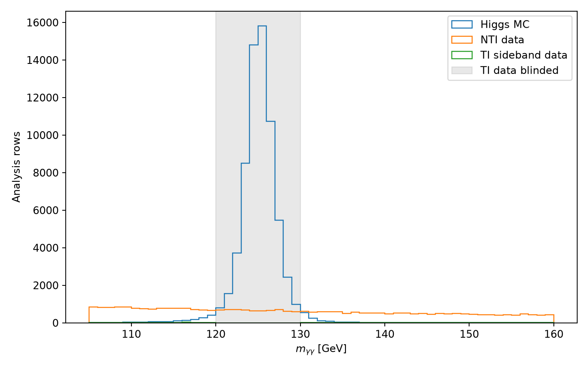

## Overview of the Analysis Strategy

The BDT uses exactly `n_central_jets, n_bjets, jet1_pt, jet_ht, diphoton_pt`. It never uses $m_{\gamma\gamma}$. The classifier is `sklearn.ensemble.HistGradientBoostingClassifier` with learning rate 0.055, 180 boosting iterations, at most 15 leaves, depth 4, minimum 20 samples per leaf, L2 regularization 1, and seed 240513. Training took 1.237 s.

Signal is SM-normalized `ttH+tH`. Background is resonant TI `ggH` in 123–127 GeV plus NTI data from 105–120 and 130–160 GeV. TI means both photons pass tight ID and tight isolation; NTI means at least one fails either condition. Class balancing is applied only after physical signal and background mixture weights are constructed. Nonpositive signed MC weights retain their signed yield value and receive zero nonnegative classifier-fit weight.

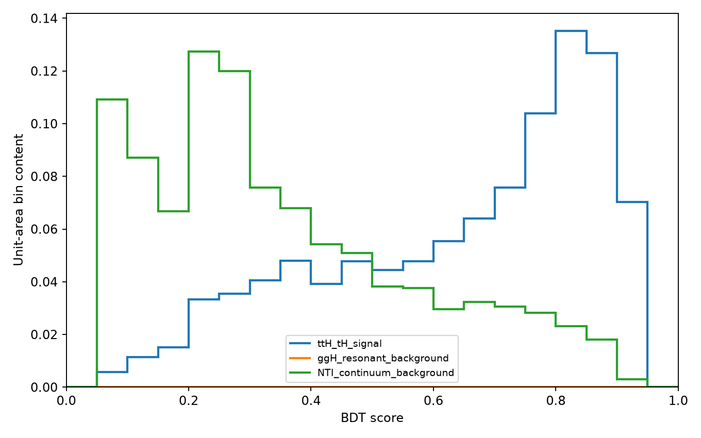

## Signal and Control Regions

The NTI normalization is `SF1 = TI_sideband/NTI_sideband = 0.026207`, `SF2 = NTI_123-127/NTI_sideband = 0.099177`, and `SF1*SF2 = 0.00259913`. Nominal observed TI data in 120–130 GeV are removed before analysis-row creation, never counted or scored in exported tables, and remain blinded. NTI entries in 120–130 GeV remain available for control-shape distributions. Observed TI sideband counts are kept separate from expected model yields.

## Cut Flow

Raw and weighted cut-flow details, including signed and absolute MC weights, are in [cutflow.json](cutflow.json) and [preselection_summary.json](preselection_summary.json).

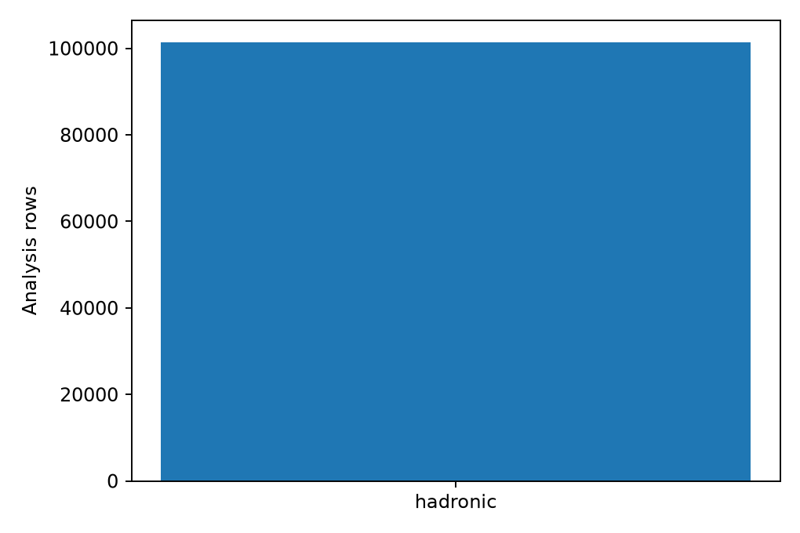

## Distributions in Signal and Control Regions

The category model uses TI Higgs MC in 123–127 GeV plus the scaled NTI sideband proxy. MC is normalized to 36 fb$^{-1}$. Class-balanced `bdt_fit_weight` is never used for yields or significances; `significance_model_weight_36fb`, `nti_continuum_proxy_weight`, and `observed_data_weight` remain separate.

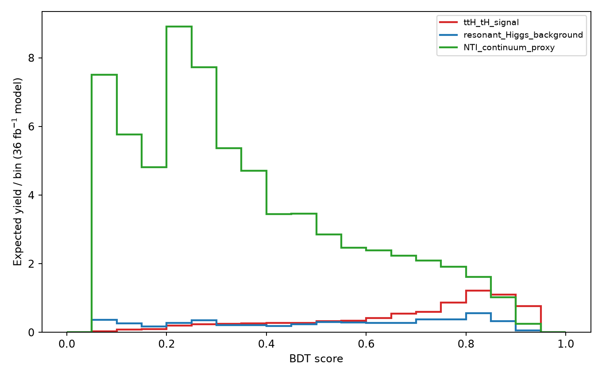

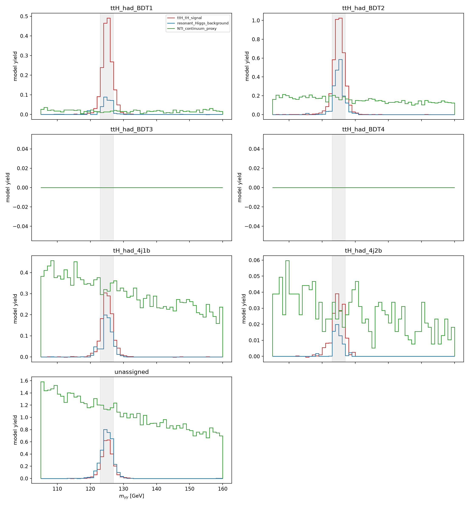

## Categorization

The accepted boundary sequence is 0.68061 (initial minimum), 0.86855 (5.5% improvement); stopping reason: `best_relative_improvement_below_5_percent`. A new split is retained only for at least 5% relative significance improvement. BDT regions have priority. The `tH_had_4j1b` and `tH_had_4j2b` cuts are evaluated only below the BDT minimum and require exactly four **central** jets and respectively one or at least two b-tags. Any non-catch-all category with expected background below 0.8 events is merged into `unassigned` before final summaries.

| category | kept | ttH+tH | total background | counting Z |
|---|---:|---:|---:|---:|
| ttH_had_BDT1 | yes | 1.464 | 1.075 | 1.2 |
| ttH_had_BDT2 | yes | 3.28 | 8.424 | 1.07 |
| ttH_had_BDT3 | no | 0 | 0 | 0 |
| ttH_had_BDT4 | no | 0 | 0 | 0 |
| tH_had_4j1b | yes | 0.9822 | 13.8 | 0.261 |
| tH_had_4j2b | yes | 0.1268 | 1.273 | 0.111 |
| unassigned | yes | 2.014 | 49.07 | 0.286 |

Combined quadrature counting significance over kept physics categories: **1.63**.

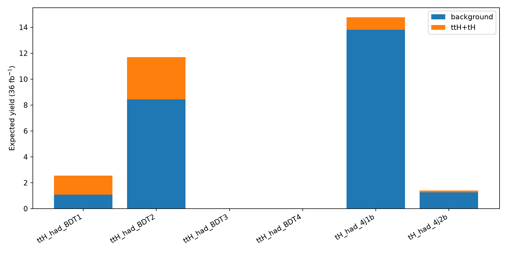

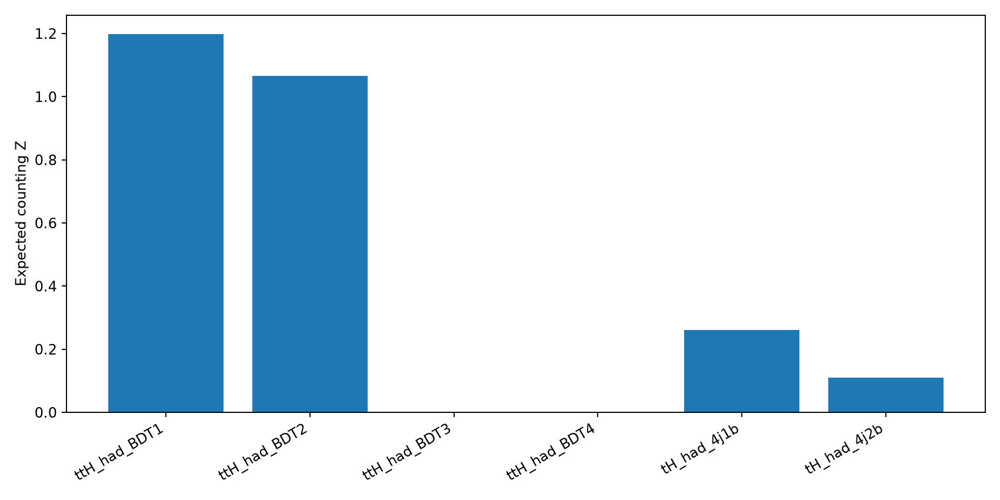

## Systematic Uncertainties

This starting-point workspace contains no nuisance-parameter model. Signed generator weights and available pileup, photon, b-tag/JVT, and flavor-tag scale factors are propagated in nominal MC yields. Experimental and theory variations, continuum functional-form uncertainty, and finite-template uncertainties must be added before physics interpretation.

## Statistical Interpretation

The backend is ROOT/PyROOT/RooFit. A shared `mu` multiplies `ttH+tH` across all kept hadronic categories. TI top-Higgs MC defines signal; TI non-top-Higgs MC is fixed resonant background. Each category's smooth continuum is fit exclusively to observed TI 105–120 and 130–160 GeV sidebands and extrapolated across 105–160 GeV. This is distinct from the NTI categorization proxy. Signal-plus-background Asimov data use $\mu_{gen}=1$; a free-$\mu$ fit and $\mu=0$ fit give $\hat\mu=0.9939\pm0.765$, $q_0=2.069$, and expected $Z=1.438$. Observed significance is blocked unless a separate explicit unblinding step is added.

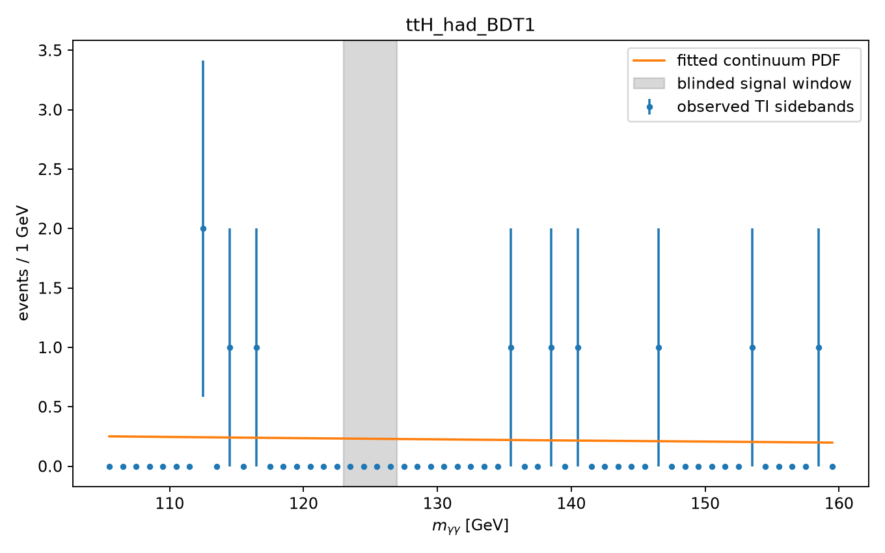
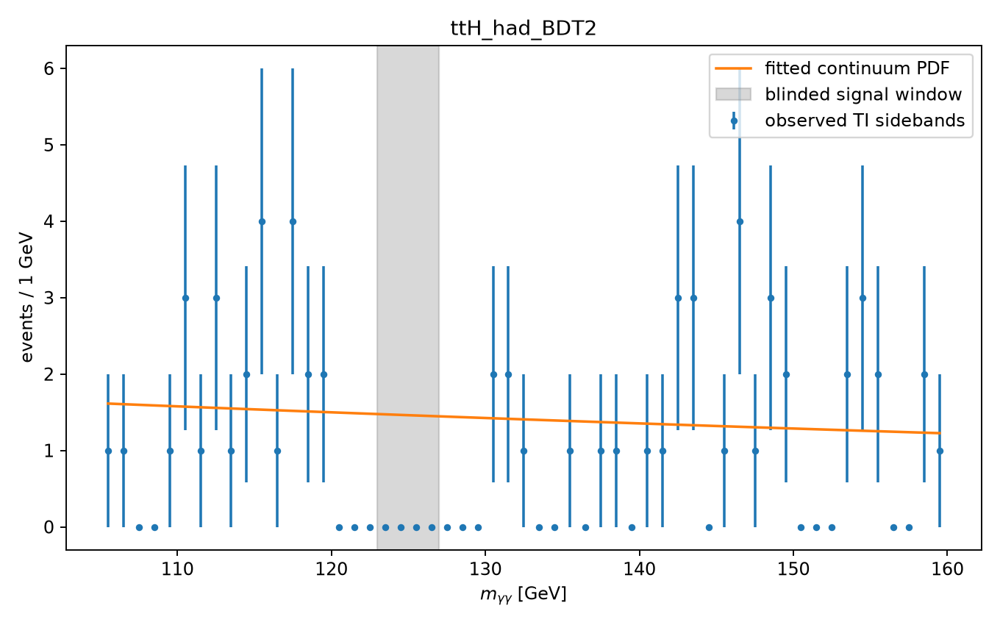
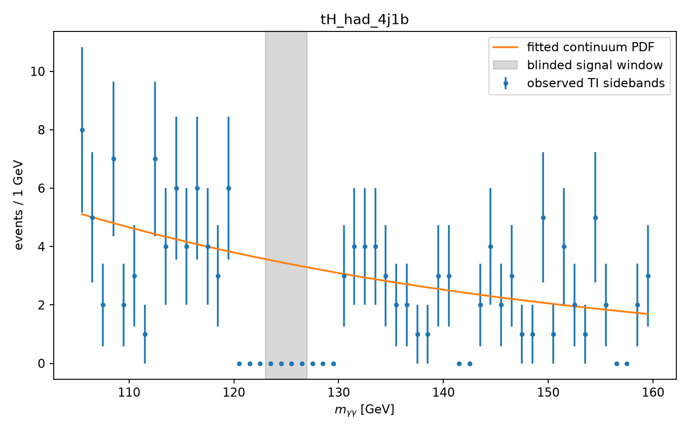
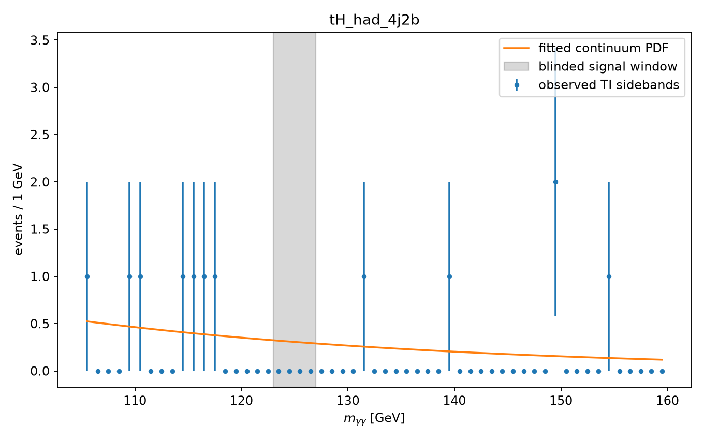

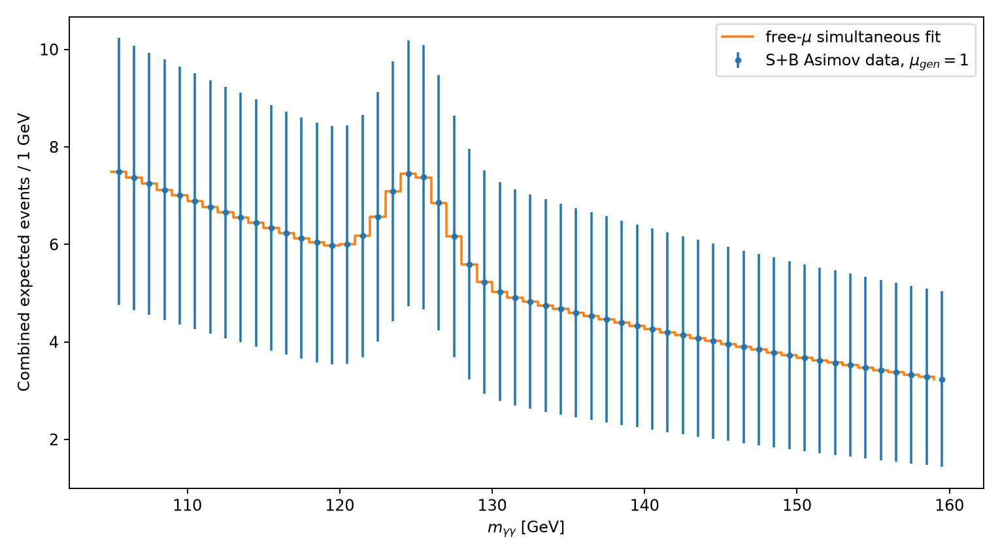

## Artifact Checklist

Machine-readable selection, weighting, training, optimization, inference, category-yield, histogram, RooFit workspace, fit-result, and manifest artifacts are present under this result directory. PNG and PDF versions are supplied for every requested final plot. [run_manifest.json](run_manifest.json) records the complete artifact validation.

## Summary

The repaired pipeline completed deterministically with hadronic-only categorization, strict input scoping, uncoupled classifier/yield weights, 36 fb$^{-1}$ physical normalization, background-based category retention, and blinded expected RooFit significance. No observed TI signal-window count or observed significance is reported.
