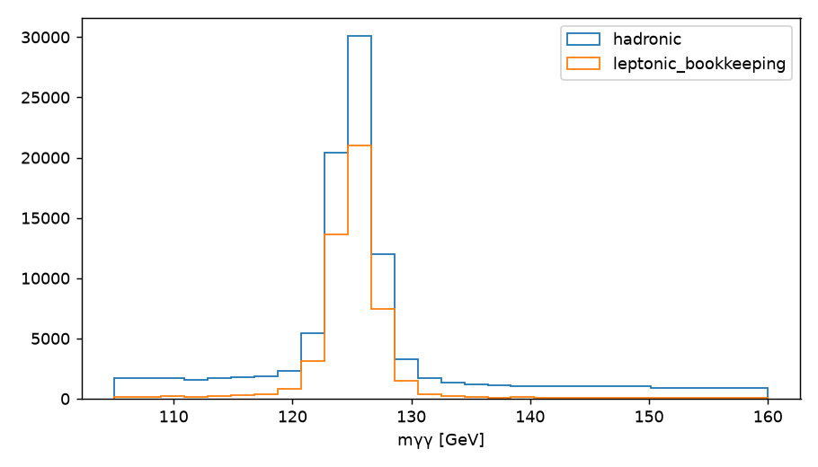
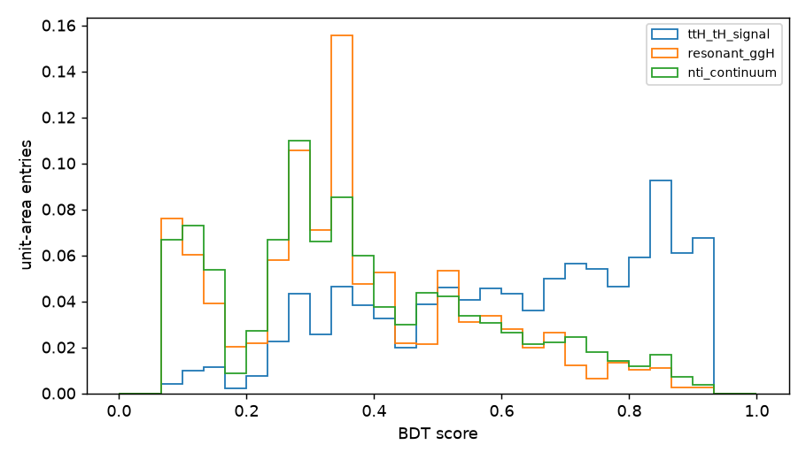
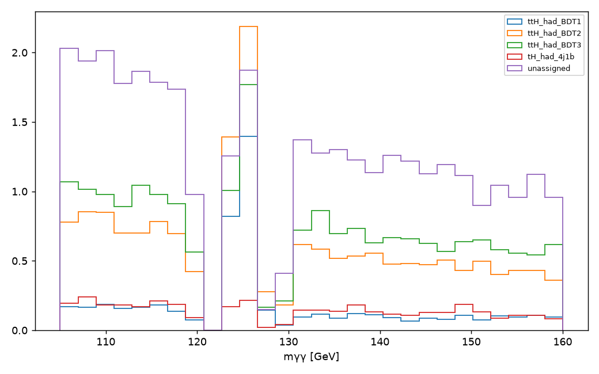
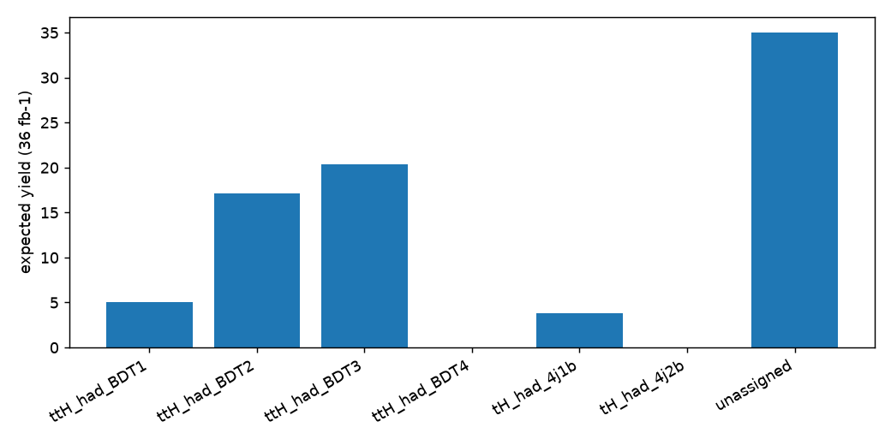
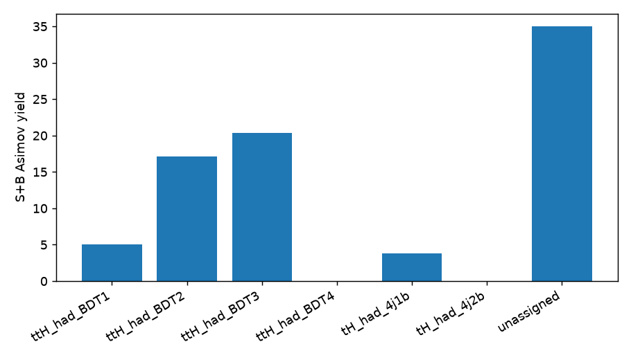
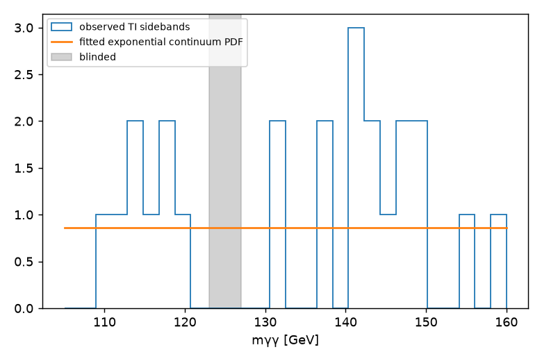

# H → γγ top-associated hadronic BDT categorization
## Introduction
Blinded deterministic hadronic starting-point analysis of ATLAS open-data GamGam inputs.
## Data and Monte Carlo Samples
Nominal Higgs MC (ggH, VBF, WH, ZH, ggZH, ttH, tH) and observed GamGam data were used. Sherpa yy and continuum MC were excluded. This run is uncapped.
## Object Definition and Event Selection
Two kinematic photons are required; tight ID and isolation are not required. Leptons use pT>10 GeV and jets pT>25 GeV. Hadronic selection is zero leptons, >=3 jets and >=1 b jet.
## Overview of the Analysis Strategy
BDT features: ['n_jets', 'n_bjets', 'jet_ht', 'lead_jet_pt', 'central_jet_fraction']; mγγ is excluded. ttH+tH is signal, while ggH and scaled NTI data form the training background.
## Signal and Control Regions
TI requires both photons tight and isolated; NTI is its complement. SF1=0.026207, SF2=0.099177, product=0.0025991. TI data at 123–127 GeV stay blinded.
## Cut Flow
Hadronic preselection rows: 272376. 
## Distributions in Signal and Control Regions

## Categorization
Physical 36 fb^-1 weights, not class-balanced fit weights, give final yields. 
## Systematic Uncertainties
This starting point retains signed normalization bookkeeping but has no nuisance-parameter systematic model.
## Statistical Interpretation
ROOT/PyROOT/RooFit workspace artifact with shared mu and S+B Asimov model: expected Z=1.435. Observed significance is blocked by TI-window blinding. 

## Artifact Checklist
Selection, inference, model, category, histogram, plot and workspace artifacts accompany this report.
## Summary
Only hadronic rows enter BDT optimization, categories and workspace. Leptonic rows are provenance-only bookkeeping.
