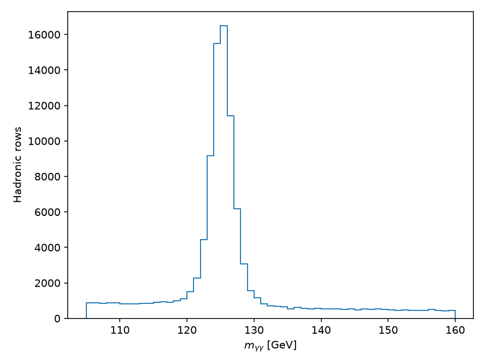
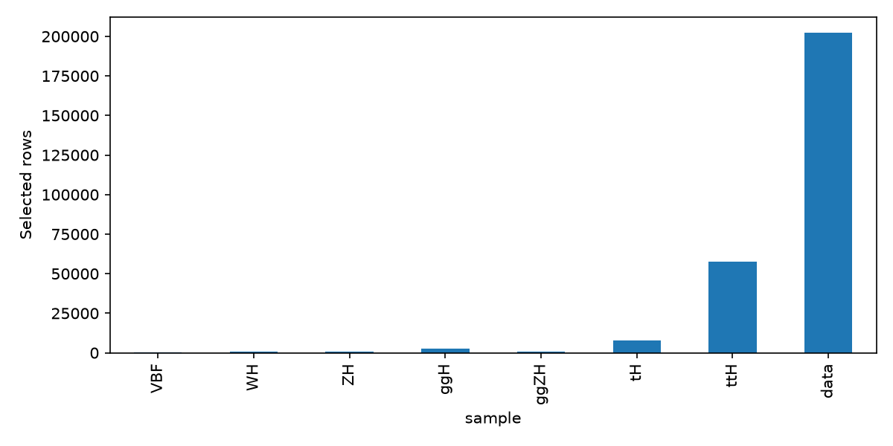
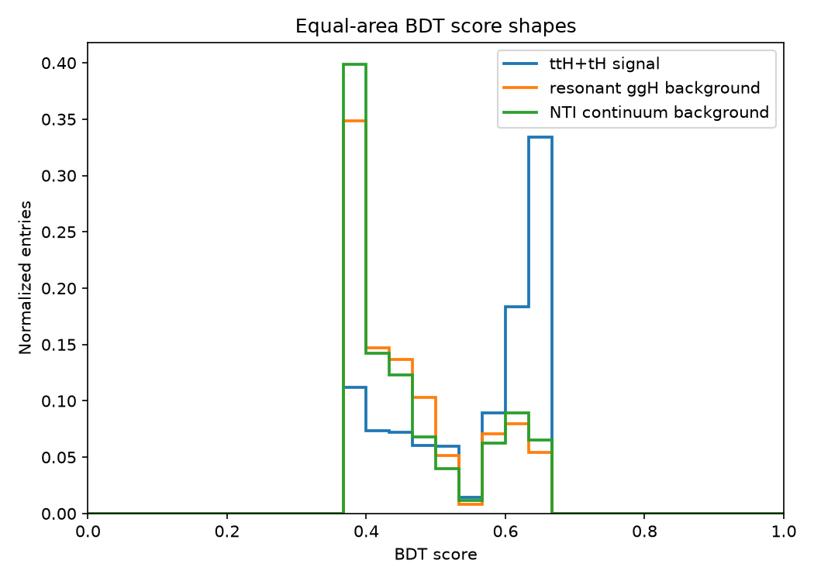
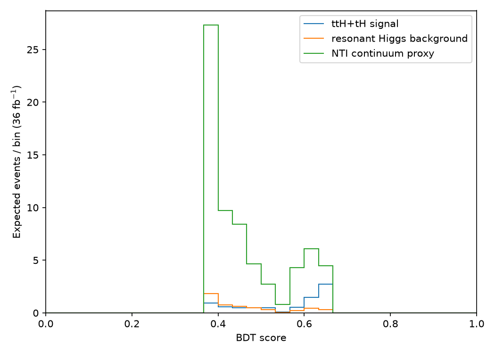
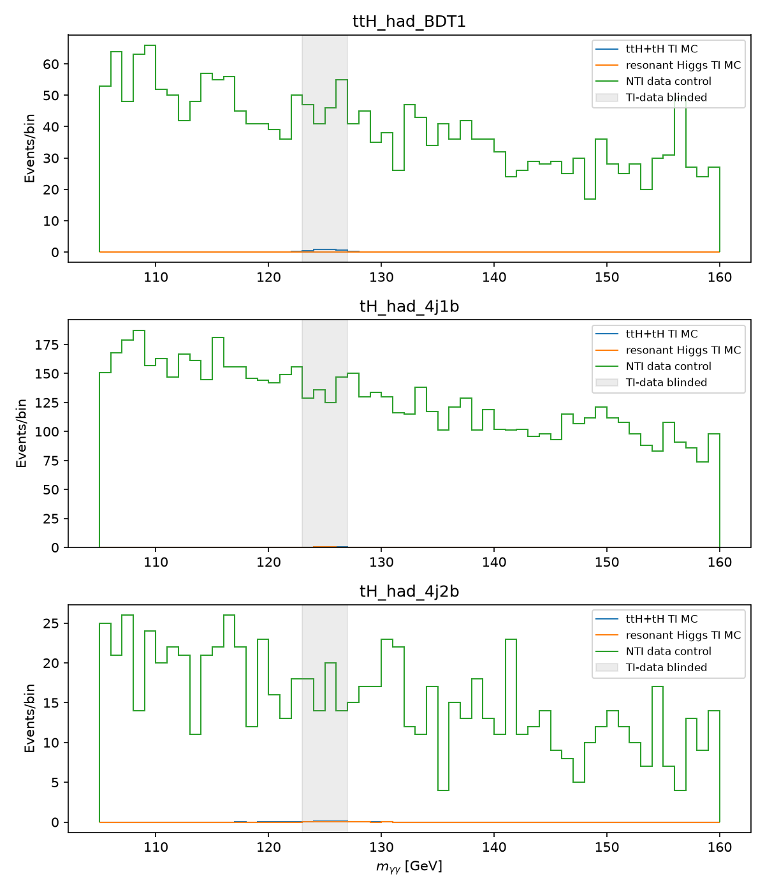
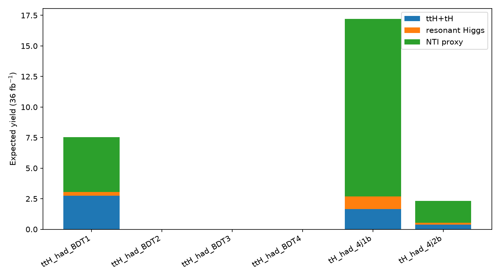
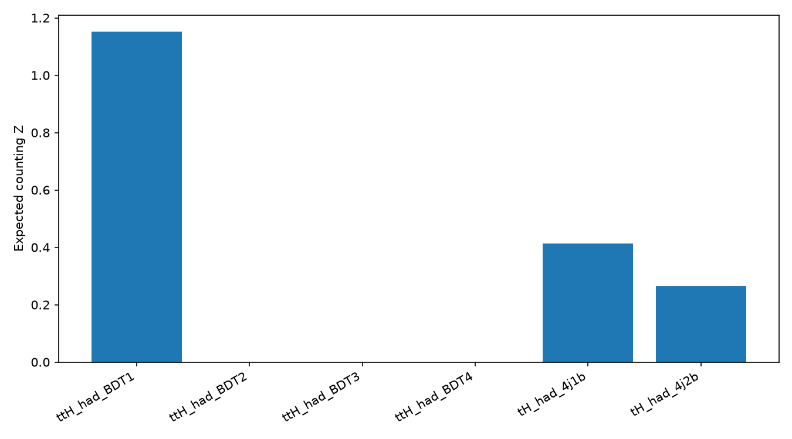
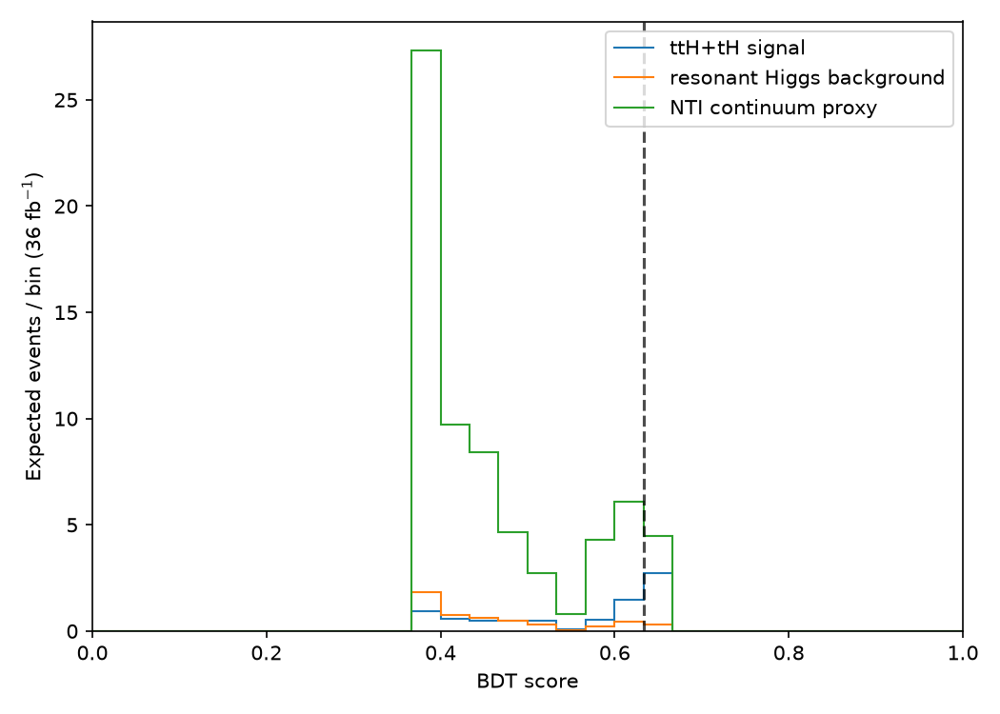
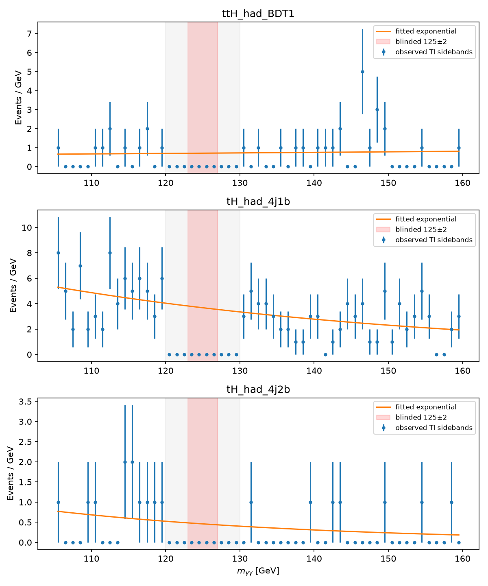
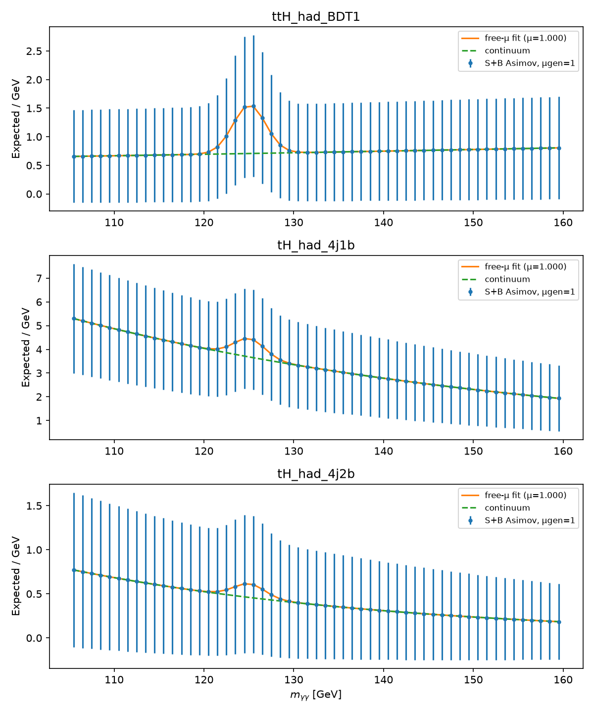

# Top-associated H → γγ hadronic BDT categorization

## Introduction
This deterministic, hadronic-only starting-point analysis categorizes top-associated Higgs diphoton candidates. Observed tight-isolated (TI) data at 125 ± 2 GeV remain blinded; observed significance is blocked.

## Data and Monte Carlo Samples
Inputs were read in place from `/data/GamGam` using the `TB_HYY_INPUTS` contract. Only nominal VBF, WH, ZH, ggH, ggZH, ttH and tH Higgs MC and observed GamGam data were processed. Sherpa yy, prompt-diphoton MC, and all non-Higgs MC were excluded. This run is **uncapped**; `TTH_MAX_SELECTED_PER_SAMPLE` is supported only as an explicit development throttle.

## Object Definition and Event Selection
Two kinematic photons have pT > 25 GeV and |η| < 2.37 excluding 1.37–1.52. Tight ID and isolation are **not** preselection requirements. Leptons require pT > 10 GeV without ID/isolation. Jets require pT > 25 GeV; central means |η| ≤ 2.5 and forward means |η| > 2.5. A b jet has `jet_btag_quantile >= 4`. The channel is zero leptons, at least three jets and at least one b jet. No leptonic rows are retained.

## Overview of the Analysis Strategy
Stable SHA-256 event IDs define 60/20/20 train/validation/test partitions. The five inputs are n_jets, n_bjets, ht_jets, leading_jet_pt, min_dr_gam_jet; mass is excluded. A deterministic HistGradientBoosting classifier (180 iterations, learning rate 0.055, 15 leaves) separates ttH+tH from ggH+NTI.

## Signal and Control Regions
Signal is ttH+tH TI MC in 125 ± 2 GeV. Background training mixes ggH TI MC in that window and NTI data in 105–120 and 130–160 GeV. TI means both photons pass tight ID and tight isolation; NTI means at least one fails. SF1=0.0262189, SF2=0.0992601, and SF1×SF2=0.00260249. NTI 120–130 GeV entries are retained for control shapes. Nominal observed TI data in the blinded window are never counted or plotted.

## Cut Flow
The recomputed hadronic selection retained 272,376 rows. Raw and signed weighted process counts are machine-readable in `cutflow.json` and `preselection_summary.json`.

## Distributions in Signal and Control Regions

## Categorization
Class balancing was applied only after physical signal and ggH+NTI weights were formed; fit sums become 0.5/0.5, while yield weights remain separate. Iterative optimization accepted 1 split(s), stopping when another split improved expected significance by less than 5%. Expected yields use signed MC normalization at 36 fb⁻¹ and the separate scaled NTI proxy. Categories below 0.8 expected background are merged/unkept. Kept categories are ttH_had_BDT1, tH_had_4j1b, tH_had_4j2b. Combined counting Z is 1.252.

## Systematic Uncertainties
This starting point includes nominal signed generator weights and available pileup, photon, b-tag and JVT scale factors. No nuisance-parameter variations are supplied by this open-data reduction; this limitation must be addressed before a precision result.

## Statistical Interpretation
A combined ROOT/PyROOT/RooFit workspace uses one shared μ for ttH+tH, fixed non-top resonant Higgs, and per-category floating smooth continuum models fitted only to observed TI sidebands. Signal-plus-background Asimov data use μ_gen=1; free-μ and μ=0 fits provide q0 and expected Z. Per-category sideband and full-range Asimov plots are linked below. The combined fit gives μ̂=1.000 ± 0.803, q0=1.8997, and expected Z=1.378. Observed significance remains blocked.

## Artifact Checklist
Configuration, contracts, object definitions, event tables, model metadata, optimization records, inference manifest/table, category yields/histograms/plots, RooFit workspace/results, and this report are present under the result root.

## Summary
An uncapped, blinded, hadronic-only ttH/tH diphoton BDT categorization was completed with deterministic partitioning and explicit separation of classifier-fit, expected-model, NTI-proxy, and observed-data weights.
