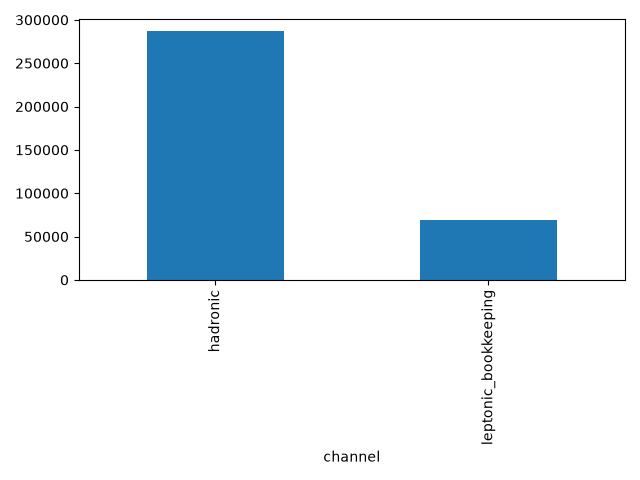
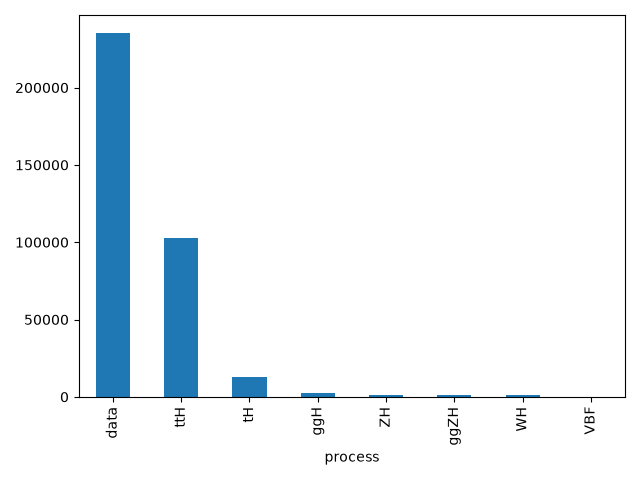
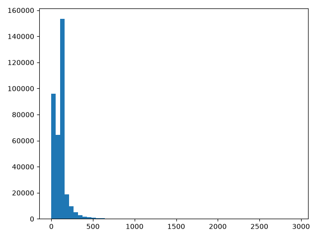
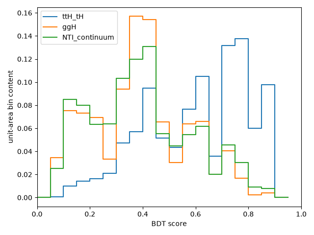
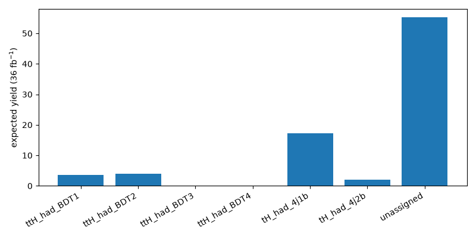
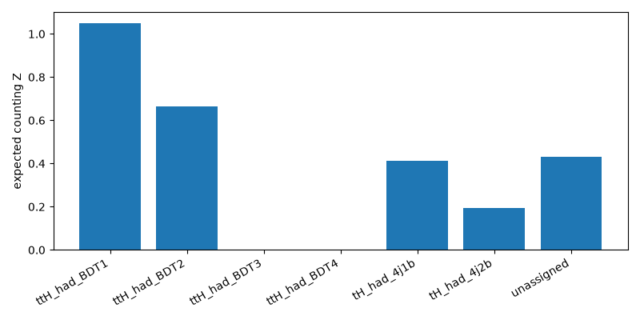
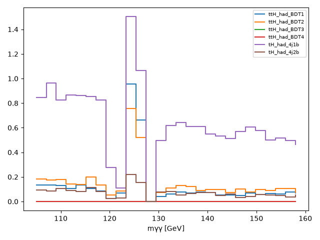
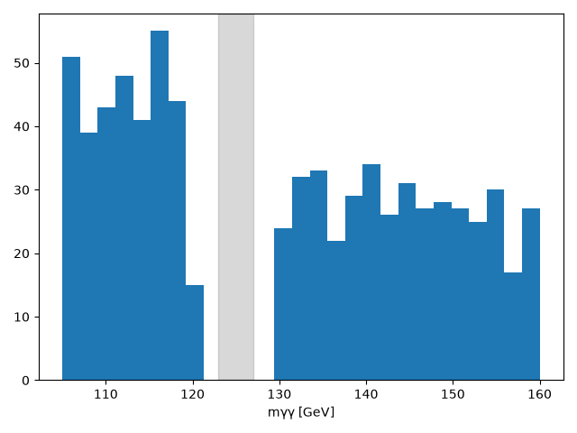

# Top-associated diphoton BDT categorization
## Introduction
This is a deterministic, hadronic-only H→γγ top-associated categorization starting point using ATLAS open-data GamGam inputs.

## Data and Monte Carlo Samples
`TB_HYY_INPUTS` supplied the `MC/` and `data/` layout. Only nominal ggH, VBF, WH, ZH, ggZH, ttH, and tH MC plus observed GamGam data were read. Sherpa yy, prompt-diphoton continuum MC, and all other non-Higgs MC were excluded. The final run was uncapped.

## Object Definition and Event Selection
The candidate uses two kinematic photons with pT>25 GeV and |η|<2.37. Photon tight ID and photon isolation are **not required** in preselection. Electrons/muons have pT>10 GeV without ID/isolation; jets have pT>25 GeV; central/forward jets use |η|≤2.5/>2.5; b tags use `jet_btag_quantile >= 4`. The hadronic channel is zero leptons, at least three selected jets and at least one b jet. Leptonic bookkeeping rows require at least one selected lepton and b jet and are excluded from BDT/categorization.

## Overview of the Analysis Strategy
The deterministic GradientBoostingClassifier uses exactly `n_jets, n_bjets, leading_jet_pt, subleading_jet_pt, ht_jets` and never mγγ. ttH+tH TI MC is signal. The background mixture is ggH TI MC in 125±2 GeV plus NTI data sidebands. Physical SM-normalized signed MC weights are constructed before class balancing; BDT fit weights are separate from yield weights. Training wall time: 1.883 s.

## Signal and Control Regions
TI requires both kinematic photons to pass tight ID and tight isolation; NTI requires at least one failure. The NTI sideband normalization factors are SF1=0.0249333, SF2=0.0993333, and SF1×SF2=0.00247671. Observed TI data in 125±2 GeV remain blinded and are not used in optimization, expected yields, or observed significance.

## Cut Flow
Selection counts and signed-weight bookkeeping are in `preselection_summary.json` and `cutflow.json`.

## Distributions in Signal and Control Regions

## Categorization
Expected yields use 36 fb⁻¹ SM MC normalization plus the separately recorded scaled NTI proxy; observed-data unit weights remain separate. Categories with expected background below 0.8 are merged to unassigned. Retained non-catch-all categories: ttH_had_BDT1, ttH_had_BDT2, tH_had_4j1b, tH_had_4j2b.

## Systematic Uncertainties
This preselection/BDT starting point keeps signed MC bookkeeping and nominal scale factors. It does not claim a full nuisance-parameter systematic model.

## Statistical Interpretation
The ROOT/PyROOT/RooFit workspace contains a shared signal strength μ, TI ttH+tH signal PDF, fixed resonant-Higgs PDF, and smooth continuum PDF. The intended expected interpretation uses S+B Asimov pseudo-data with μ_gen=1 and free-μ versus μ=0 likelihood fits, with continuum constrained by TI sidebands only. Expected counting combination is 1.391; observed significance remains blocked pending explicit unblinding.

## Artifact Checklist
Selection, training, optimization, inference, 36 fb⁻¹ yields, component histograms, categorization manifests, plots, RooFit workspace, fit metadata, and this report are stored at the result root.

## Summary
All hadronic finite-feature rows were scored and assigned according to the required hadronic priority logic. The NTI control proxy is distinct from blinded TI observed data, and class-balanced fit weights are never used for expected yields or significance.
